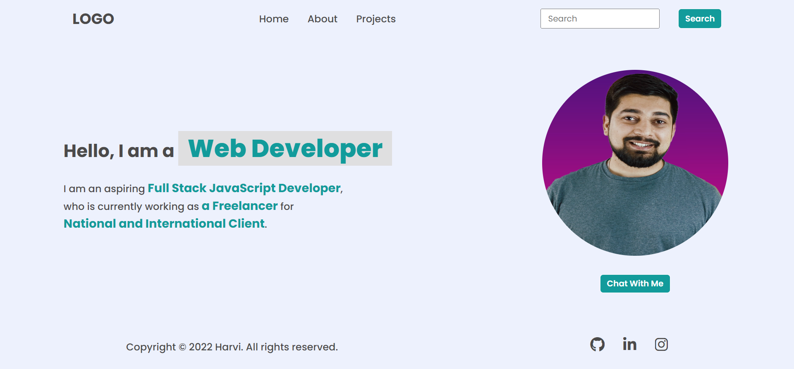

# **DOM Assignment 1**

## **Task 1**

The user want to remove the last menu item **contact** and add the two new menu items **Projects** and **Hire me** and hide the social icons form bottom.

### **After Update**


### **Project Solution**
```js
// add a new menu item
let element = document.querySelector('nav ul');
element.removeChild(element.lastElementChild);
element.insertAdjacentHTML("beforeend", `<li><a href="#">Projects </a></li> <li><a href="#">Hire me </a></li>`);

//hide the social icons
document.querySelector('footer ul').style.display="none";
```

## **Task 2**

The user wants to change the placeholder of search box form **"Search"** to **"Search my project"**

### **After Update**


### **Project Solution**
```js
//Change placeholder
document.querySelector(".search-field").firstElementChild.placeholder="Search My Project";
```

## **Task 3**

The user wants to change the **"a Freelancer"** and **"National and international Client"** text form the hero section. 

### **After Update**


### **Project Solution**
```js
//Change the text
document.querySelector('.hero-left-section p span').[1].innerText="an Employee";
document.querySelector('.hero-left-section p span').[2].innerText="iNeuron Intelligence Pvt Ltd";
```

## **Task 4**

The user wants to change the image of hero section.

### **After Update**


### **Project Solution**
```js
//Change the text
document.querySelector('.hero-right-section img').src = "https://avatars.githubusercontent.com/u/11613311";
```

## **Task 5**

The user wants to add a new **Support me** button next to **Chat with me** button.

### **After Update**


### **Project Solution**
```js
//add new button
let element = document.querySelector('.hero-right-section-btns');
let newButton = document.createElement('button');
newButton.innerText="Support me";
element.appendChild(newButton)
```

